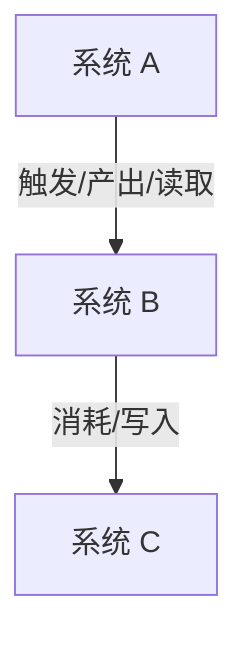
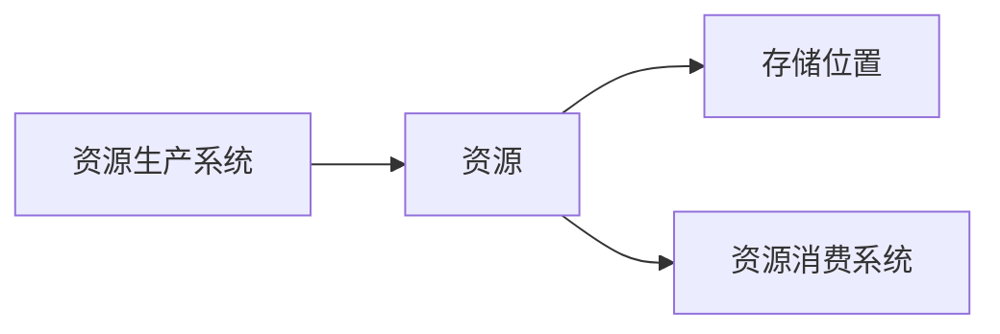

# 设计选项体系与系统关联图规范

## 结论

`Subway_Surfers.md` 不能作为通用项目参考。它的 `[x]` 选择、主目标和具体系统只代表那个案例。

真正可以通用的是文档中的“设计选项体系”：

- 设计域。
- 决策章节。
- checklist 项。
- 每个设计问题。
- 每个问题下的候选选项。
- 选项代码。
- 验收维度。

新项目不能继承范本的已选项。新项目必须用自己的设计文档在这个选项体系中重新选择。

## 两层数据

### option_taxonomy

可以通用。

```json
{
  "domain": "核心体验设计",
  "decision": "核心循环决策",
  "checklist_item": "行动入口",
  "dimension": "体验目标",
  "question": "玩家通过什么行动进入循环？",
  "options": [
    {"label": "爽快释放", "code": "flowRelease"},
    {"label": "精通成长", "code": "masteryGrowth"},
    {"label": "收集-强化-解锁", "code": "collectUpgradeUnlock"}
  ]
}
```

### case_selection

不能通用。

```json
{
  "case": "Subway Surfers",
  "selected": "flowRelease",
  "is_primary": true
}
```

## 新项目使用流程

1. 读取当前项目设计文档。
2. 用 `option_taxonomy` 建立需要回答的问题集合。
3. 从当前项目文档中抽取已回答问题。
4. 将当前项目答案映射到候选选项。
5. 对未回答问题生成 `open_questions.json`。
6. 对已回答且会形成系统的内容生成系统图。
7. 对资源、货币、分数、道具、配置、奖励等生成资源流转图。
8. 禁止把范本的 `case_selection` 当作当前项目答案。

## 步骤 1 必须产出

步骤 1 不是固定拆出某个参考项目的系统，而是根据当前项目设计文档拆出当前项目自己的系统。

建议产物：

- `option_coverage_report.json`
- `project_option_selection.json`
- `open_questions.json`
- `system_relation_graph.json`
- `system_relation_graph.mmd`
- `resource_flow_graph.json`
- `resource_flow_graph.mmd`

## system_relation_graph 结构

```json
{
  "nodes": [
    {
      "id": "system_id",
      "name": "系统名称",
      "source": "current_design_doc.md:120",
      "selection_refs": ["option.code"],
      "type": "gameplay | economy | content | social | live_ops | platform | support | data"
    }
  ],
  "edges": [
    {
      "from": "system_a",
      "to": "system_b",
      "relation": "depends_on | triggers | reads | writes | configures | rewards | consumes",
      "resource": "optional_resource_id",
      "source": "current_design_doc.md:180"
    }
  ]
}
```

## resource_flow_graph 结构

```json
{
  "resources": [
    {
      "id": "resource_id",
      "name": "资源名称",
      "source": "current_design_doc.md:220",
      "producers": ["system_a"],
      "consumers": ["system_b"],
      "storage": "account | session | config | server | local_save | none"
    }
  ],
  "flows": [
    {
      "from": "producer_system",
      "to": "consumer_system",
      "resource": "resource_id",
      "operation": "create | grant | convert | consume | store | display | expire",
      "source": "current_design_doc.md:260"
    }
  ]
}
```

## Mermaid 模板





## 校验规则

- 所有系统节点必须来自当前项目设计文档、用户确认或 `repair_patch.json`。
- 所有资源必须有生产者、消费者和存储位置。
- 未被当前项目文档选择的范本选项不能生成系统。
- 范本 `[x]` 选项不能作为当前项目选择。
- 如果当前项目文档没有回答某设计问题，只能进入 `open_questions.json`。
- 如果当前项目文档写了运营、活动、商业化或上线支持，就按系统开发处理。
